# TrajectoryPlanning

A Unity-based project for a robot trapizoidal joint motion planning, and visualizing motion simulation. UR10e robot model used as an example.

### Requirements
- Unity: 6000.2.0f1 or newer

### Main external package dependencies
- Zenject (dependency injection)
- UniRx (reactive programming)
- OneOf (option types)
- Newtonsoft.Json (JSON serialization)
- MathNet.Numerics (linear algebra)
- NSubstitute (mocking)
- FluentAssertions (assertions)

Note: Unity will resolve the necessary Unity packages via the Package Manager on first open.

### Getting started
1. Clone the repository.
2. Open the project in Unity Hub using Unity 6000.2.0f1.
3. Let the Package Manager resolve dependencies.
4. Open your main scene

### Testing
- In Unity: open Window > General > Test Runner, then run EditMode tests

### UML / Architecture
The following diagram provides a high-level overview of the project’s components:

